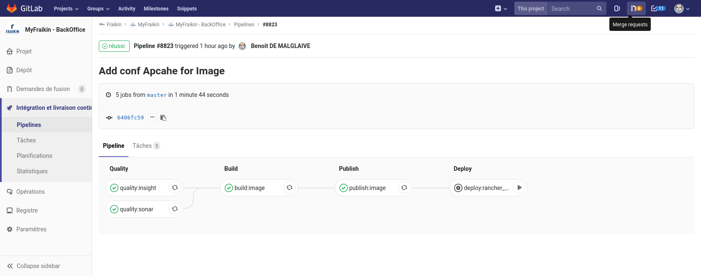

Processus de livraison
=============

On décrit ici la procédure de déploiement pour les différents environnements du projet.

#  Sur rancheur dev

1. Merger les modifications sur `master`
2. S'assurer que le _pipeline_ est passé sans problème
3. Lancer l'action manuelle `deploy:rancher_dev` (menu _manual actions_ en fin de ligne dans la vue `CI / CD > Pipelines`)

Si la tache de déploiement peut être bloquée si le _pipeline_ a été exécuté depuis trop longtemps (expiration du cache d'artifact).  
Dans ce cas :
 * Soit relancer le _pipeline_ pour regénérer un artifact à déployer,
 * Soit utiliser la commande `Re-deploy` dans la section `CI / CD > Environments`

#  En Pré-production

Pour déployer une "release"
1. Pour créer une "release", crée un tag GIT qui correspond à la valeur du champ version mise dans le fichier "composer.json"       Exemple : Git Tag  "x.y.z" et "x.y.z" dans champ version de "composer.json"
2. La CI de GitLab génère une release qui est stoker dans [Artifactory](https://repo.cicd.sedona.fr/artifactory)
3. A définir...

Pour déployer un "snapshot"
1. Pour créer un "snapshot", indiquer dans le champ version du "composer.json" la future version suivit de "-dev". 
Exemple : x.y.z-dev dans champ version de "composer.json"
2. La CI de GitLab génère un snapshot qui est stoker dans [Artifactory](https://repo.cicd.sedona.fr/artifactory)
3. A définir...

#  En production

TODO : a définir

[Retour au README.md](../README.md)
