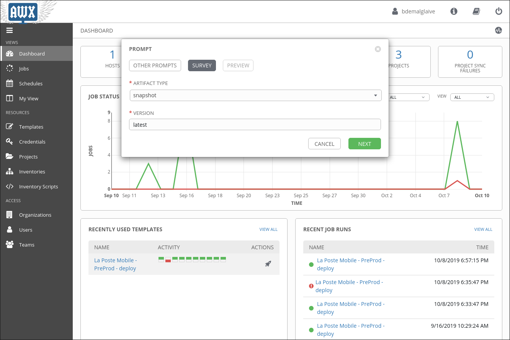

Processus de livraison
=============

On décrit ici la procédure de déploiement pour les différents environnements du projet.

#  Pour créer une artefacte à déployer

## Pour créer une "release"

1. Indiquer une version dans le fichier ["composer.json"](https://git.sedona.fr/bpi/catalogue/bpi-catalogue/-/blob/master/composer.json) telle que "x.y.z".
2. Créer un [tag GIT](https://git.sedona.fr/bpi/catalogue/bpi-catalogue/-/tags) qui correspond à la valeur du champ version mise dans le fichier "composer.json".
3. La [CI de GitLab](https://git.sedona.fr/bpi/catalogue/bpi-catalogue/-/pipelines) va génèrer une release qui est stokée dans [Artifactory](https://repo.cicd.sedona.fr/artifactory/webapp/#/artifacts/browse/tree/General/php-release-local/fr/bpi/catalogue/catalogue-site)

## Pour créer un "snapshot"

1. Indiquer la version future dans le fichier ["composer.json"](https://git.sedona.fr/bpi/catalogue/bpi-catalogue/-/blob/master/composer.json) suivi de "-dev" telle que "x.y.z" . 
2. Créer un [tag GIT](https://git.sedona.fr/bpi/catalogue/bpi-catalogue/-/tags) qui correspond à la valeur du champ version mise dans le fichier "composer.json".
3. La [CI de GitLab](https://git.sedona.fr/bpi/catalogue/bpi-catalogue/-/pipelines) va génèrer une release qui est stokée dans [Artifactory](https://repo.cicd.sedona.fr/artifactory/webapp/#/artifacts/browse/tree/General/php-snapshot-local/fr/bpi/catalogue/catalogue-site)

#  En recette Sedona

1. Créer un artefact de type "release" ou "snapshot".
3. Aller sur [AWX](https://awx.cicd.sedona.fr/#/templates?template_search=id__icontains_DEFAULT:57)    
   A. Cliquer sur la fusée.    
   B. Saisir le type de package "release" ou "snapshot".      
   C. Saisir la version a déployé pour une "release" et "latest" pour un "snapshot".    

#  En Pré-production & Préprpduction

1. Créer un artefact de type "release" ou "snapshot".
2. Envoyer un mail a la BPI pour prévenir qu'une nouvelle version est a déployer.

[Retour au README.md](../README.md)
